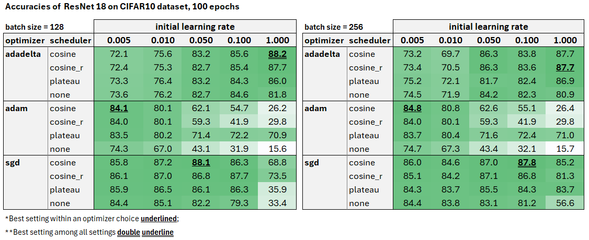

# Examples

## Simple training
To train `PyTorch` example model with their original settings, run:

```bash
python train.py --model simplenet --dataset mnist --epochs 14 --batch-size 64 --lr 1 --o adadelta --w-decay 0 --sched step --save-model --log-train
```

This will save the model state with better accuracy in `./saved_models`, the training logs in `./training_log` and print the accuracy obtained.

If there is a trained model already, to load and evaluate it run:

```shell
python load_and_evaluate.py --model simplenet --dataset mnist
```
## Hyperparameter exploration

For all that follows, I experimented with the following options

For optimizers:
*   Stochastic Gradient Descent (`sgd`)
*   Adadelta (`adadelta`)
*   Adam (`adam`)
*   For optimizer-specific hyperparameters:
    *   `weight-decay = 5e-4` for the `CIFAR10` case
    *   for `sgd`, I use a nesterov momentum of 0.9 and no dampening.
    *   Everything, I kept at the defaults

For schedulers:
- Step Learning Rate (`step`): simple reduce by 0.1 every 5 iterations as in the PyTorch example
-  Reduce on plateau (`plateau`): reduce the LR by a factor of 0.1 if the test loss does not improve after 5 epochs
-   Cosine Annealing (`cosine`): change the LR following a cosine annealing pattern (see details [here](https://pytorch.org/docs/stable/generated/torch.optim.lr_scheduler.CosineAnnealingLR.html))
-  Cosine Annealing with warm restarts (`cosine_r`): similar to Cosine Annealing, but fully resets the learning rate after a specified amount of iterations (see details in the original [paper](https://arxiv.org/abs/1608.03983) and in [pytorch docs](https://pytorch.org/docs/stable/generated/torch.optim.lr_scheduler.CosineAnnealingWarmRestarts.html)
	- specifically, similar to proposed in the original paper, first restart happens at 5 epochs and increases by 2 each time (next in 10th epoch, then 20th, and so on)
- None (`none`): no scheduler
- There is also an option for `cyclic`, but since the cosine schedulers also involve a somewhat cyclic behavior, I did not experimented with it.
### MNIST experiments

The following table shows all the individual accuracies obtained for the `ResNet18` in the `mnist` dataset by changing the learning rates, schedulers and optimizers. Marked in red is the `ResNet18` model using the same settings as in the PyTorch's example. Underlined are the best models for a given optimizer; double underline is the best model among all variations.

**Comments:**

- In MNIST, `ResNet` presents high accuracy for almost all combinations of parameters, except for some poor configurations, such as Adam optimizer with no scheduler and a higher learning rate (which probably made the model to not converge in only 14 epochs)
    
- The change of network from `SimpleNet` to `ResNet18` (keeping scheduler, LR and optimizer constant) leads to an improvement of around 0.3 p.p.
    
- But since accuracies are very similar, it is difficult to get a reasonable metric of what affects the final accuracy the most.
	- For instance, the accuracy of the best combination (sgd, plateau, lr =0.1) is only 0.07 p.p. higher than the accuracy obtained with the same parameters as used in SimpleNet (in red)
- And it is not direct to disentangle the gains in terms of scheduler, optimizer and learning rates, since they depend in a non-obvious manner to each other and to the `ResNet` architechture.
	- Nonetheless, relative to the `SimpleNet` settings, for `ResNet`:
		- Keeping _scheduler and learning rate constant_, there is a worsening of -0.16pp of switching to the `sgd` optimizer
		- Reducing the learning rate to 0.1 relative to (sgd,1) leads to an increase in 0.12pp
		- changing the scheduler to plateau relative to (sgd, step) gives another 0.11pp increase
		- Therefore, the improvement was equally impacted by the scheduler and initial learning rate and did not improve due to change in the optimizer (but again, this is not linear as in the math above)
- This suggests that (i) comparing the accuracies for this case are not fully informative; (ii) `adadelta` might still be a good choice, even though does not gives strictly the higher performance (indeed, in CIFAR10 produces the best performance)


Perhaps a better way of gaining knowledge about the tuning options that might be used further is analyzing the sensitivities of the accuracies relative to the variables. The three tables below shows the max change in accuracy when kept one tuple of LR, scheduler and optimizer constant.

Regarding the sensitive to the scheduler
-  `adadelta` tends to be less sensible, followed by the `sgd` optimizer, which shows a higher drop in accuracy for high learning rates
- the `adam` optimizer display high sensibility, even for reasonable learning rates.

Regarding the sensitive to the learning rate:
*   `adadelta` accuracies are more stable for changes in the learning
*   For `adam` and `sgd`, on the other hand, variations are greater.
	* This is largely due to the very low accuracies when the initial learning rate is one. The numbers are less drastic for `sgd` if we remove these observations, but still volatile for `adam`

Regarding the sensitive to the optimizer:
*   we see the choice of optimizer is key: there is no scheduler that not suffer from a poor choice of (lr,optimizer) pair.
*   The less sensitive is `cosine`, which shows better convergence for learning rates smaller than one

It is worth noticing that some of these results (such as the `adam` high sensitivity) might be an artefact of the low number of epochs for this case.

Nonetheless, they give hints for tuning the parameters for more expensive tasks, like in CIFAR10. For instance:
*   using `sgd` perhaps we might prefer lower learning rates; for `adadelta`, starting with lr=1 might be ok (indeed, this is the setting that leads to better performance in CIFAR10)
*   be careful with choices of learning rates and schedulers when using `adam`
*   a higher stability of results when using (adadelta, cosine) relative to variations in learning rates, which is a good feature since we do not know in principle which `lr` is good and cannot explore all possibilities as in here.


### CIFAR10 experiments
For what follows, the following set of parameters were kept the same:


Besides the parameter tuning, I also tranform the CIFAR10 dataset as proposed in the original ResNet paper.

The tables below shows the accuracy of `ResNet18` for different learning rates, schedulers, optimizers and two batch sizes. As in part 1, the best configuration within an optimizer is underlined and the best among all has double underline. In all cases, the models ran for 100 epochs.

**Comments**
*   The max performance achieved was around 88% for (adadelta, cosine, lr=1, batch=128).
    *   This performance could be further increased with more epochs and other data transformations.
    *   But since accuracy is reasonble and the focus is on the changes in performance due to changes in tuning, I did not went further into this path
*   Similar to the analysis for the `mnist` dataset in part 1:
    *   `adadelta` tends to overall give more stable results, despite variations in the `(scheduler, LR)` pairs.
    *   the `adam` optimizer tends to perform better for smaller learning rates, and poorly for higher learning rates
    *   We see that the same `lr=1` tends to give the better performance when optimizer is `adadelta`
    *   `sgd` also shows good results, but is more sensible to the tuning (as expected) than `adadelta`
*   Different from part 1, a poor choice of optimization parameters can lead to very poor performance.
*   Regarding learning rates, in general:
    *   using `adadelta` the learning rates have to be higher;
    *   for `adam` smaller learning rates are preferable and
    *   for `sgd`, learning rates smaller to 1 were sufficient for reasonable convergence.
    *   This is similar to the pattern highlighted in the sensitivity analysis using `mnist` dataset
*   Regarding optimizer choices:
    *   We see that the optimizer choice can indeed make a big difference, specially if coupled with bad choices for the initial learning rate and/or scheduler.
    *   `adadelta` was the optimizer that tended to show less sensible results and achieve. It also showed good accuracy in general, except for lower learning rates.
        *   but notice that results are not volatile among the lower LR
    *   This suggests that `adadelta` might be a good choice if one is not so sure about the learning rates and schedulers to use.
    *   If one is more sure of parametrization, perhaps using `sgd` might be desirable, since it is more customizable and performs well when well parametrized - at the risk of worse performance if bad parametrization.
*   `batch size` in general had small effects on accuracy. The exception is using the `sgd` optimizer, in which results were less sensible to the initial LR chosen with higher batch sizes.
*   The `cosine` scheduler showed better accuracy/convergence behavior. In particular, the results were less sensible to the starting LR in the `sgd` case.



## Measuring Performance

Metrics were measured in a machine with the following specs:
*   GPU NVIDIA RTX 4090 with 16GB of RAM GDDR6
*   CPU Intel Core i9-13980HX
*   RAM 96GB 5600MHz DDR5
*   Linux Ubuntu (WSL2 distribution)

For testing,
*  Six ResNet architechtural choices were tested; see `Readme-Resmobile` section for description.
*  Hyperparameters were fixed at the scheme that gave the best and less volatile accuracies using the original `ResNet` model in the `Performance section`

The table below show the accuracies for each option, along with the performance metrics.
**Comments:**
*   we see that options 0 and 1 in all convolutions reduces the memory footprint and amount of MMAc operations substantially (around 90$). However, there is a relatively high drop in accuracy (8 to 9 pps)
*   Option 2, by its turn, gives a better trade-off: a 2.7 percent decrease in accuracy while reducing the memory and MMAcs by more than 80%. This is in line with intuition, since here we preserve the convolutional layer that is responsible for extracting features of the raw input data.
*   We see that it is possible to arrive at a delta accuracy of only 0.8pp when using DSC only in the 1st convolutional layers within a basic block, but the savings in terms of memory and flops are more modest.
*   All in all, I would suggest Option 2 or Option 4, depending on the importance of resources used vs accuracy. Both offer a good performance, but with at least 34% less flops and 50% less memory - which might be relevant for phones, for instance

**About latency**
*   Notice that in all cases, despite the smaller use of resources and flops, the models with DSC present **higher** latency (some miliseconds slower).
    
*   A possible reasons for the difference is that `PyTorch` or `CUDA` might have more optimized routines for traditional convolutions, but not for the grouped convolutions used in DSC.
    
*   In particular, the memory-access patterns for DSC can be different and less cache-friendly than traditional convolutions.
    
*   This would be reasonable, since traditional convolutions are more frequently used and PyTorch/CUDA are general purpose softwares
    
*   Nonetheless, the usage of DSC is still relevant, since these operations might be optimized for devices in which they are used.
    
    *   For instance, the memory-access patterns can be tailored for the GPUs/CPUs used in cellphones (and it might be more doable to tailor if less resources are needed)

    *   the comments above suggest that no, they are not; we should expect a reduction in latency, but this is not what was observed. And my best explanation for that are memory access patterns and lack of optimizations for the DS convolutions.
    *   Nonetheless, the size of the `pytorch` checkpoint files is reduced in a similar % as the reduction in memory footprint estimated.


